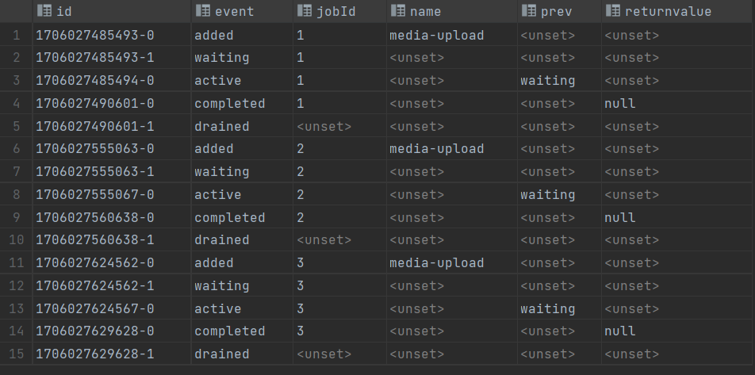
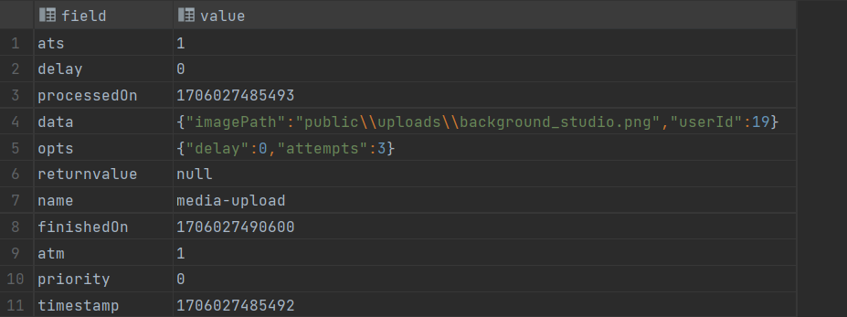

# BullMQ Image Utility

### Handling large number of image request using BullMQ and Redis

### Making Retries on Image Server On Third Party Server Failure either cloudinary or s3

- All Image request are queued in Redis
  

- Image Data stored in Redis
  
